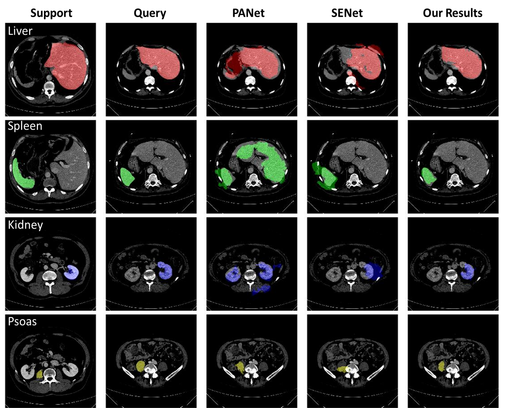

# A LOCATION-SENSITIVE LOCAL PROTOTYPE NETWORK FOR FEW-SHOT MEDICAL IMAGE SEGMENTATION

This repo contains the code for our ISBI 2021 paper [A LOCATION-SENSITIVE LOCAL PROTOTYPE NETWORK
FOR FEW-SHOT MEDICAL IMAGE SEGMENTATION](https://arxiv.org/pdf/2103.10178).

Our code implementation is on the basis of the code from:
https://github.com/kaixin96/PANet

The above link is a code implementation of the following paper: Wang, Kaixin, et al. "Panet: Few-shot image semantic segmentation with prototype alignment." ICCV 2019.(https://arxiv.org/abs/1908.06391)

## Introduction

Since strong spatial priors exist in many medical imaging modalities, we propose a prototype-based method—namely, the location-sensitive local prototype network—that leverages spatial priors to perform few-shot medical image segmentation. Our approach divides the difficult problem of segmenting the entire image with global prototypes into easily solvable subproblems of local region segmentation with local prototypes. For organ segmentation experiments on the VISCERAL CT image dataset, our method outperforms the state-of-the-art approaches by 10% in the mean Dice coefficient. Extensive ablation studies demonstrate the substantial benefits of incorporating spatial information and confirm the effectiveness of our approach.

## Data Preparation for Visceral Dataset

For all our experiments, we utilized contrast-enhanced CT scans from the VISCERAL dataset <sup>[1](https://ieeexplore.ieee.org/abstract/document/7488206/)</sup>. We used 65 silver corpus scans for training and 20 gold corpus scans for testing. For the 65 silver corpus scans, we found the range the range of each oragan slices (along a fixed orientation) and turned the 3D organ scans into 2D image slices (about 20 anatomical structures in each CT scan). Once you have downloaded the VISCERAL dataset, you can run the data preparation code `create_Visceral_dataset.ipynb`. To evaluate 2D segmentation performance on 3D volumetric images, we follow the protocol described in SENet <sup>[2](https://arxiv.org/pdf/1902.01314)</sup>.

## Train and Test

1. Change configuration via `config.py`, then train the model using `sh local_prototype_network_visceral_1way_1shot_[train].sh`.
2. After training, you can test the model performance through jupyter notebook file `eval_dice.ipynb`.

## Qualitative Results
Evidently, our method successfully transfers semantic information from support to query images to produce high-quality segmentation results despite different organ sizes and shapes. 


## Citation
If you find this code helpful, please cite it. BibTeX reference is as follows.
```
@inproceedings{yu2021location,
  title={A Location-Sensitive Local Prototype Network For Few-Shot Medical Image Segmentation},
  author={Yu, Qinji and Dang, Kang and Tajbakhsh, Nima and Terzopoulos, Demetri and Ding, Xiaowei},
  booktitle={2021 IEEE 18th International Symposium on Biomedical Imaging (ISBI)},
  pages={262--266},
  year={2021},
  organization={IEEE}
}
```